# Published portfolio website  
 [Arisa Okuyama](https://arisaokuyama.github.io/aboutme/)

# GitHub repository  
 [github link](https://github.com/ArisaOkuyama/aboutme )
 
# Purpose
 This portfolio was created to present my skills and introduce myself to potential future employee includes my background and communication skills though the resume provided.

# Sitemap

[Sitemap PDF](/docs/sitemap.pdf)

# Functionality / features

Top page:  
My name with little animation to start with. All social media links provided in order to contact me easily and check recent update. 

Menu bar:  
It links to 4 HTML pages. For mobile user has a hamburger menu to choose. For more than 600px wide devices has a fixed nav bar at the top of the screen and stays when scrolling and when hover, background color changes.

About me page, Skill & Project page,  :  
PDF resume, a video of Ruby project are attached with responsive paragraph for each devices 

Blog page:  
It has own nav bar that sort the blog of each month.  Also each post has a link "TOP" to go back to the top of the screen and a facebook icon to share and a twitter icon to tweet about the blog post.

Contact page:  
I used gradation color for background-color to bright up the page with social media icons and a contact form that made with a form css.

Footer menu bar:  
Each pages has a menu bar at the bottom to move to different page.

All links:  
All links can access within a new tab.

# Screenshots

For Mobile  

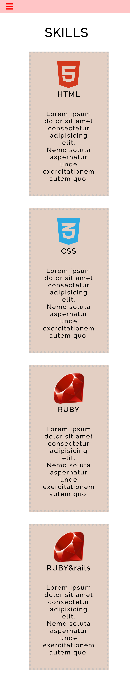

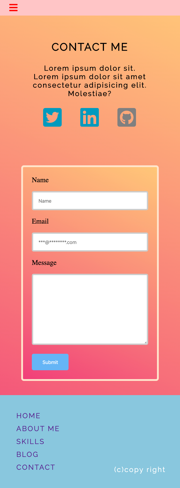
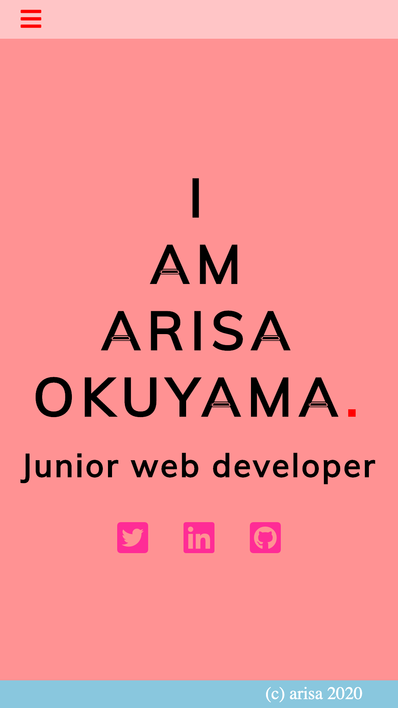
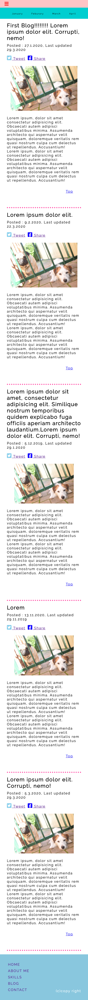  

For Ipad  
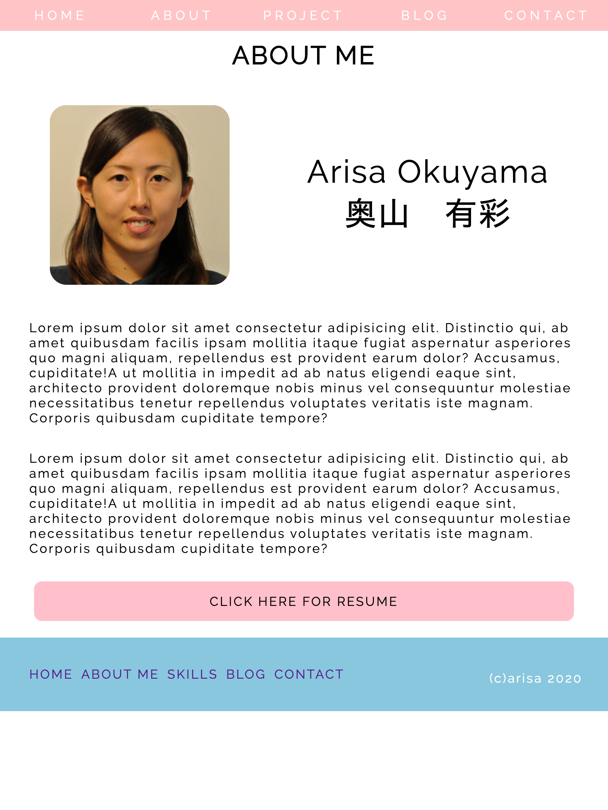
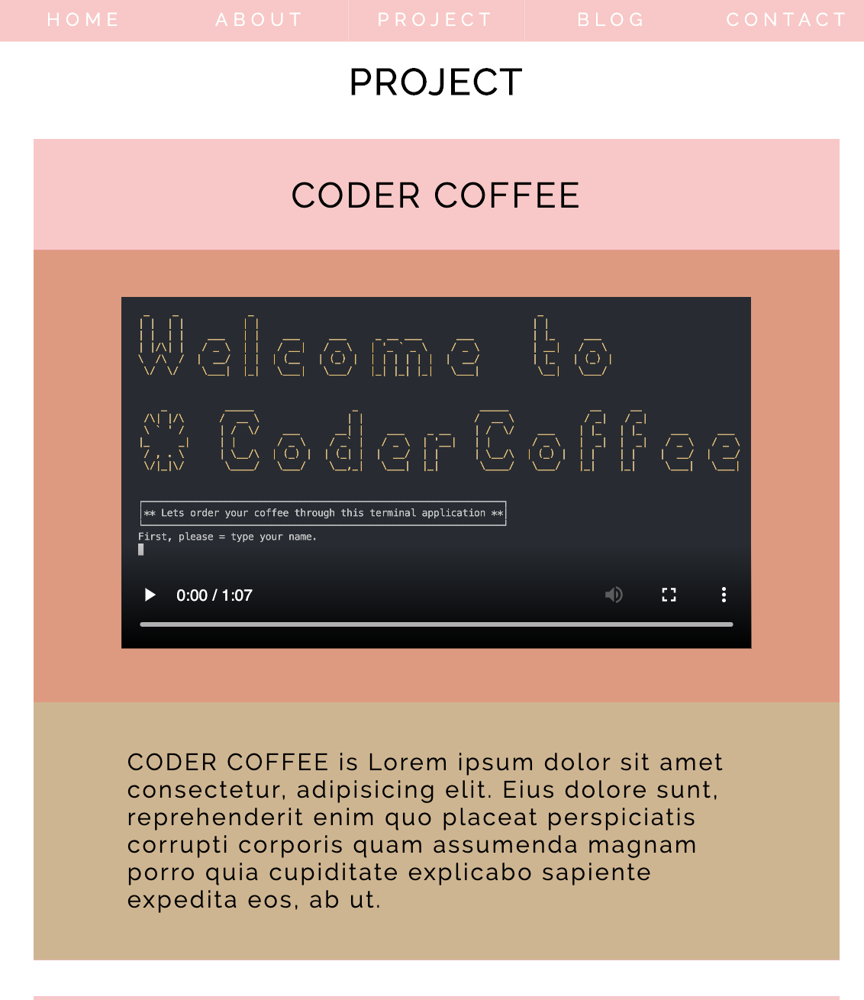
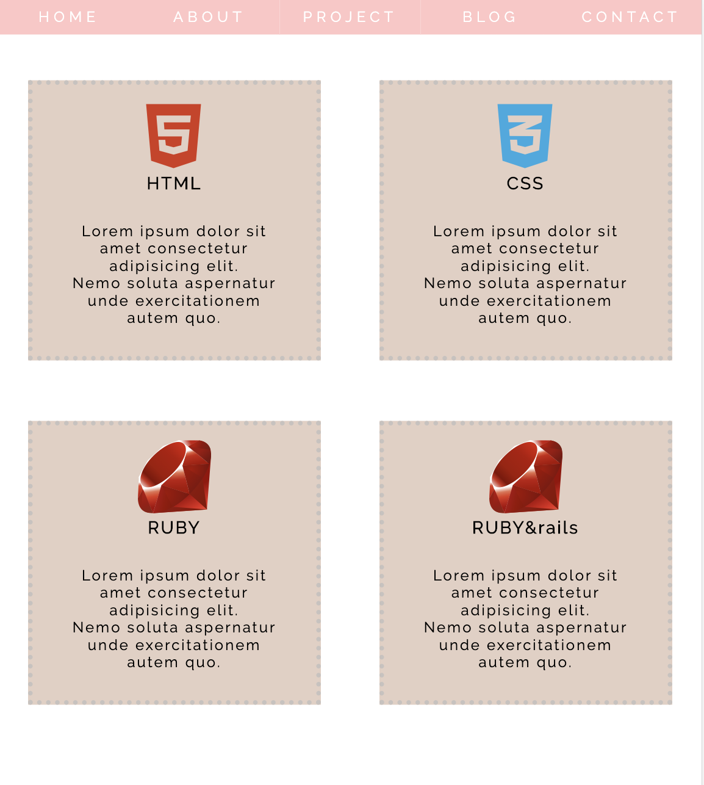  

For Laptop  
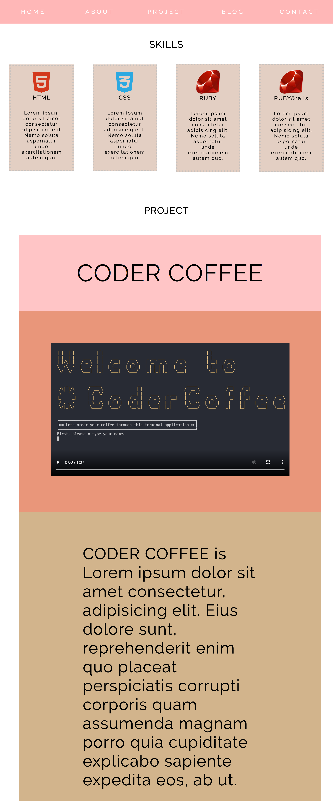
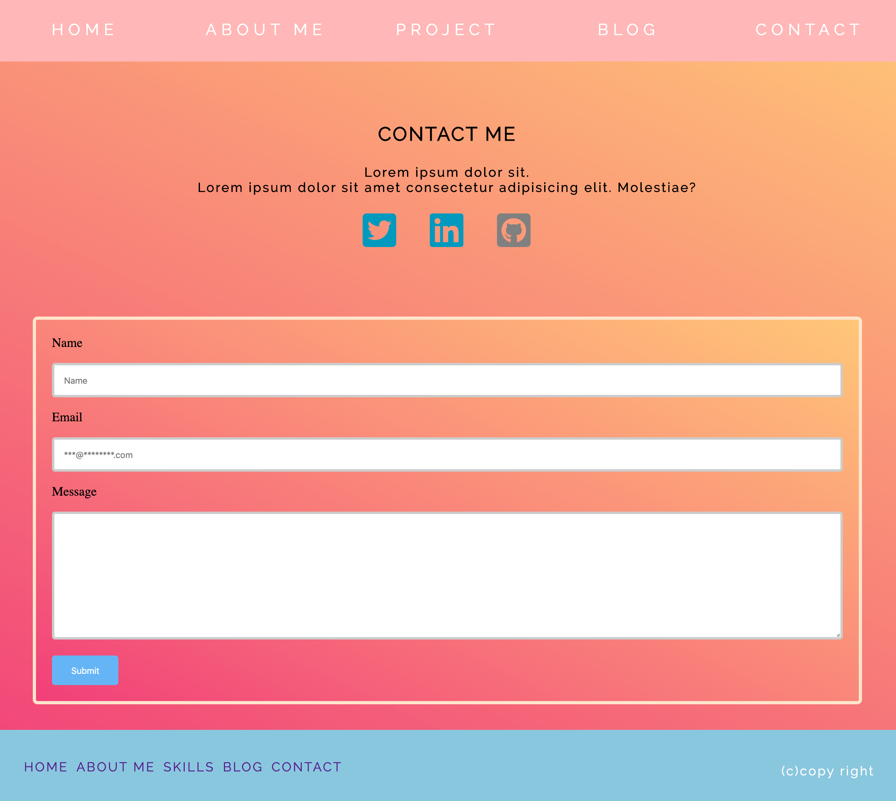

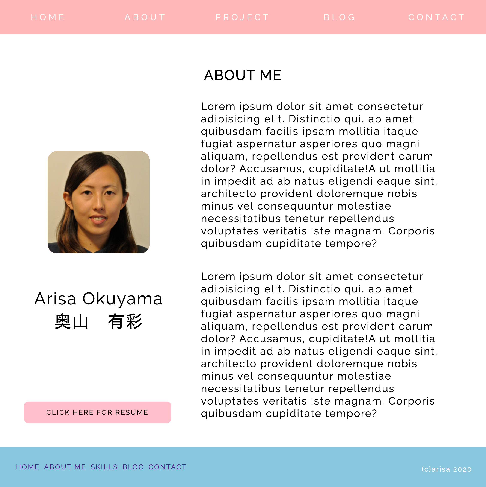
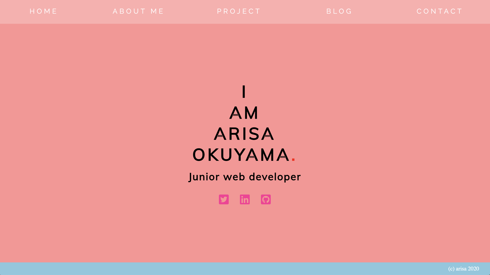

# Target audience

future / potential employees.

# Tech stack 

HTML
CSS
Font awesome
Google font
Github for deployment
